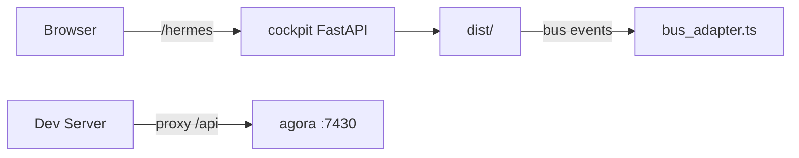

# cockpit-ui — Architecture

> **Layer**: L3 入口层  
> **Role**: 操作员控制台 Web 视图 — 观察/调度/调试 OMO 多 Agent 工作流  
> **Stack**: TypeScript, React 19, Vite, Bun, React Flow  
> **Health**: See local build verification and cockpit integration state
> **SSOT**: 集成状态、构建状态、入口挂载情况以本项目验证链和 workspace governance SSOT 为准
>
> 系统全景参见：[`../../docs/PANORAMA.md`](../../docs/PANORAMA.md)

---

## 1. 内部架构



## 2. 入口

| Type | Entry | Port / Notes |
|:--|:--|:--|
| Dev | `bun run dev` | :5173 |
| Build | `bun run build` |  |
| Production | `mounted by cockpit FastAPI at /hermes` |  |

## 3. 核心模块

| Module | Responsibility |
|:--|:--|
| `src/App.tsx` | Main app |
| `src/components/Dashboard.tsx` | Dashboard view |
| `src/components/WorkflowGraph.tsx` | Workflow topology graph |
| `src/hermes_console/bus_adapter.ts` | agora.bus TS adapter |

## 4. 测试

```bash
cd projects/cockpit-ui && bun run lint && bunx tsc --noEmit
```
