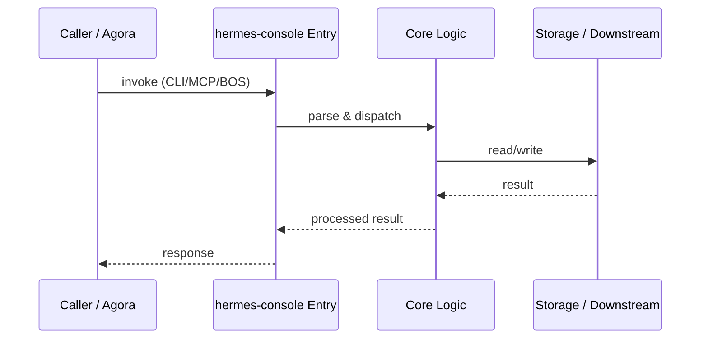

# hermes-console — Call Chain

> 本文档描述 hermes-console 内部最核心的一条调用链 / 数据流。
>
> 通用跨层调用链参见：[`docs/I0-AGORA-CALLCHAIN.md`](../docs/I0-AGORA-CALLCHAIN.md)

---

## 关键路径

1. 1. Dev: `bun run dev` proxies `/api` to agora :7430
2. 2. Production: cockpit serves `dist/` at `/hermes`
3. 3. `bus_adapter.ts` connects to agora bus for events
4. 4. Dashboard and WorkflowGraph render OMO workflow state

## Sequence Diagram

